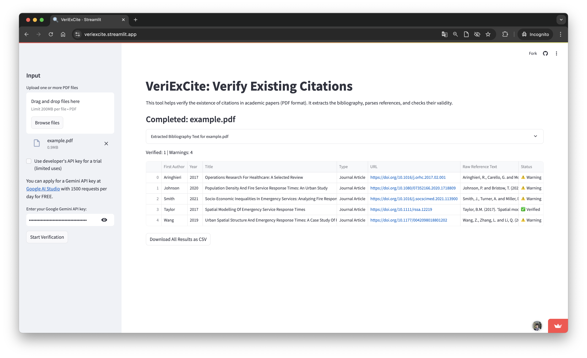

# VeriExCite: Verify Existing Citations

[](https://www.python.org/downloads/) [](https://www.gnu.org/licenses/agpl-3.0)

**VeriExCite** is a Python tool designed to help you verify the existence of citations in academic papers (PDF format). It extracts the bibliography section from a PDF, parses individual references, and then checks their validity against Crossref and Google Scholar databases.

## Why VeriExCite?

The rise of powerful LLMs has brought with it the potential for generating realistic-looking, yet entirely fabricated, academic references. While tools like ZeroGPT attempt to detect LLM-generated text, they rely on "black box" deep learning methods, which are prone to both false positives and false negatives, making them unreliable for definitive judgments. However, the presence of fabricated references within a manuscript provides *concrete* evidence that (at least part) of the text may be LLM-generated. VeriExCite focuses on this crucial aspect of academic integrity.

## Features

*   **Extraction:** Extracts the bibliography section from PDF documents.
*   **Parsing:** Uses Google Gemini API to parse references into structured data (title, authors, DOI, type). 
*   **Verification:**
    *   Checks references against Crossref and Google Scholar.
    *   Identifies potentially fabricated citations.
*   **Reporting:**
    *   Provides a summary of verified, skipped (e.g., non-academic references, such as a government website or a dataset), and potentially fabricated references.
    *   Outputs results to a CSV file for easy analysis.
*  **Folder Processing:** Processes all PDF files in a directory in a single run, suitable for academics and teaching assistants in marking scenarios.
*  **Privacy-Conscious:** Only the bibliography section of the PDF is sent to the Google Gemini API. This is crucial for complying with university policies that often prohibit uploading student work (which students hold copyright for) to third-party LLM services. The full text of the paper *is not* uploaded.


## Usage

### 1. Try the Web App

For quick and easy verification, use our web app: [https://veriexcite.streamlit.app/](https://veriexcite.streamlit.app/) 

[](https://veriexcite.streamlit.app/)

The web app allows you to upload one or more PDF files directly and see the results in your browser. 

### 2. Local Installation

You can also run VeriExCite locally with Python. 

#### Prerequisites
- Python 3.10 or higher
- [uv](https://github.com/astral-sh/uv) - Fast Python package installer and resolver

#### Steps

1. Clone the repository:
```bash
git clone https://github.com/AdamZhou3/VeriExciting.git
cd VeriExciting
```

2. Install dependencies using uv:
```bash
uv pip install .
```

3. Run the Streamlit app:
```bash
streamlit run streamlit_app.py 
```

**Set Google Gemini API Key:**

*   Obtain an API key from [Google AI Studio](https://ai.google.dev/aistudio). It's free with 1500 requests per day!
*   Set your API key to the `GOOGLE_API_KEY` variable in the code. 

#### 2.1 Single PDF File

```python
from veriexcite import veriexcite

pdf_path = "path/to/your/paper.pdf"
count_verified, count_warning, count_skipped, list_warning = veriexcite(pdf_path)

print(f"{count_verified} references verified, {count_warning} warnings, {count_skipped} skipped.")

if count_warning > 0:
    print("Warning List:")
    for item in list_warning:
      print(item)
```

#### 2.2 Process a Folder of PDFs

```python
from veriexcite import process_folder

folder_path = "path/to/your/pdf/folder"
process_folder(folder_path)
```
This creates `VeriCite results.csv` file in the current directory.

## Interpreting Results

*   **Found References:** The total number of references extracted from the bibliography section of the PDF.
*   **Skipped website:** Websites are skipped because they often lack the structured metadata needed for reliable verification.
*   **Verified:** References that were successfully matched in Crossref or Google Scholar.
*   **Warnings:** References that could *not* be verified. 
*   **Warning List:** The raw text of the unverified references. 

> [!IMPORTANT]
>
> A "warning" from VeriExCite indicates suspicion. Manual verification is required. 

